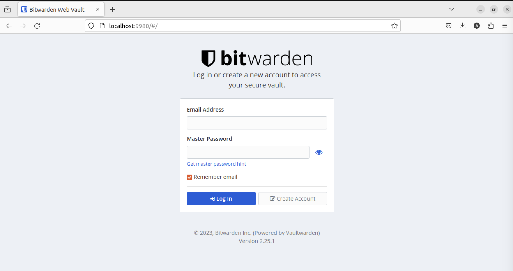

## CS410/510: Install a gitlab instance on your ubuntu system. This should be fully containerized and added to your docker-compose.yml file. Document the installation and configuration in your final.md file.
- I got struggle with arm64 architure again for setting up gitlab instance on my ubuntu system. 
- ref: https://www.czerniga.it/2021/11/14/how-to-install-gitlab-using-docker-compose/ but these docker images from this doc only supported for AMD platform while my machine is ARM64.
- https://docs.gitlab.com/ee/install/docker.html doesnt work for arm64 machine
- https://github.com/surya-kant/gitlab-arm64 seemed working, but It ended up with restarting the image all the same. I did do `docker logs ` for this images. Many text codes kept running non-stop like a loop after waiting for a while. 
##### https://hub.docker.com/layers/zengxs/gitlab/16.6-ee-arm64/images/sha256-6ce8de661a2badc2886a7ff1f27f723847d594afa36fe890fc7fdb1d43c6b3ee?context=explore - Finally, this docker is working!
- ref: https://github.com/zengxs/gitlab-arm64/tree/main
- Here's a docker-compose.yml
```
version: '3.8'

services:
  gitlab:
    image: zengxs/gitlab:16.6-ee-arm64
    container_name: gitlab
    restart: unless-stopped
    privileged: true
    hostname: gitlab.local
    environment:
      GITLAB_OMNIBUS_CONFIG: |
        external_url 'http://gitlab.local'
        gitlab_rails['gitlab_shell_ssh_port'] = 9922
    ports:
      - "9999:80"      # Web interface
      - "9443:443"     # HTTPS 
      - "9922:22"      # SSH access to repositories
    volumes:
      - ./gitlab-config:/etc/gitlab
      - ./gitlab-logs:/var/log/gitlab
      - ./gitlab-data:/var/opt/gitlab
    shm_size: '256m'

volumes:
  gitlab-config:
  gitlab-logs:
  gitlab-data:

```
- This is a heavy image. After pulling it, it took 8 - 10 minutes to build a complete container for testing purposes.
- Updated some pass rules for the firewall in `/etc/pf.conf` in the bastion host, freebsd.
```
# Define the ports used by GitLab
http_port="9999"
https_port="9443"
ssh_port="9922"

...

# Port Forwarding Rules for GitLab
rdr pass on $ext_if inet proto tcp from any to any port $http_port -> $ubuntu_vm_ip port 80
rdr pass on $ext_if inet proto tcp from any to any port $https_port -> $ubuntu_vm_ip port 443
rdr pass on $ext_if inet proto tcp from any to any port $ssh_port -> $ubuntu_vm_ip port 22

# Firewall rules to allow traffic to GitLab
pass in on $ext_if inet proto tcp from any to $ubuntu_vm_ip port {80, 443, 22}
pass out on $int_if inet proto tcp from $ubuntu_vm_ip to any port {80, 443, 22}
```
#### Testing: 

- Open `http://localhost:9999` on a browser

- Login as `root`
  - To find a password for the root, we need to access the docker container by ` docker exec -it gitlab /bin/bash`
  - ` cat /etc/gitlab/initial_root_password ` OR using `sudo` at the front if needed for the premission.

- Final result: 


## CS410/510: Install a dockerized, self-hosted bitwarden instance. You aren’t required to make use of it, but it needs to be there. This will allow you to keep all your passwords in one place – that you control. Configuration files should live on a mapped volume. Document the installation and configuration in your final.md file.
- Here's a docker-compose.yml:
```
version: '3.8'

services:
  bitwarden:
    image: bitwardenrs/server:latest
    restart: always
    volumes:
      - ./bw-data:/data
    environment:
      WEBSOCKET_ENABLED: 'true'  # Enable WebSocket notifications
      SIGNUPS_ALLOWED: 'true'    # Set to 'true' to allow signups
      ADMIN_TOKEN: 'admin_token' # Replace a complex token, but i left there for testing.
    ports:
      - 9980:80                  # HTTP port
      - 3012:3012                # WebSocket port

```

- Updated some pass rules for the firewall in `/etc/pf.conf` in the bastion host, freebsd.
```
# Port Forwarding for Bitwarden
rdr pass on $ext_if inet proto tcp from any to any port 9980 -> $ubuntu_vm_ip
rdr pass on $ext_if inet proto tcp from any to any port 3012 -> $ubuntu_vm_ip

# Firewall rules to allow Bitwarden traffic
pass in on $ext_if proto tcp to $ubuntu_vm_ip port { 9980, 3012 }
pass out on $int_if proto tcp to $ubuntu_vm_ip port { 9980, 3012 }
```
- Run on `localhost:9980`. Here's a result for testing:



## CS410/510: Install a containerized ZoneMinder, for security camera monitoring. This should be configured to use a mapped volume for storage. Document the installation and configuration in your final.md file.
- I was looking for a docker image of ZoneMinder on dockerhub. There was no images supporting for ARM64 at first.

- Ref: https://github.com/ZoneMinder/zmdockerfiles
- ~~I found another image from https://hub.docker.com/r/ponte124/zoneminder, nvm this image didn't work out for me.~~ 
- ~~I did find another one which is from https://github.com/stefano-garzarella/zoneminder-armhf, https://hub.docker.com/r/sgarzarella/zoneminder-armhf~~
- Finally, I ended up using this docker image from https://hub.docker.com/r/homelabs/zoneminder/tags that is `docker pull homelabs/zoneminder:latest`. It does support for ARM64. It seems running for me.
- Here is a docker-compose.yml:

```
version: '3.8'
services:
  zoneminder:
    image: homelabs/zoneminder:latest
    container_name: Zoneminder
    privileged: true
    ports:
      - "9443:443/tcp"
      - "9000:9000/tcp"
      - "9970:80/tcp"
    environment:
      - TZ=America/Los_Angeles 
      - SHMEM=50%
      - INSTALL_HOOK=1
      - INSTALL_FACE=1
    volumes:
      - ./config:/config:rw
      - ./data:/var/cache/zoneminder:rw
    restart: unless-stopped

volumes:
  config:
  data:
```
- Updated some pass rules for the firewall in `/etc/pf.conf` in the bastion host, freebsd.
```
# ZoneMinder Port Forwarding
rdr pass on $ext_if inet proto tcp from any to any port 9443 -> $ubuntu_vm_ip
rdr pass on $ext_if inet proto tcp from any to any port 9970 -> $ubuntu_vm_ip
rdr pass on $ext_if inet proto tcp from any to any port 9000 -> $ubuntu_vm_ip

# Firewall rules for ZoneMinder
pass in on $ext_if proto tcp to $ubuntu_vm_ip port { 9970, 9000, 9443 }
pass out on $int_if proto tcp to $ubuntu_vm_ip port { 9970, 9000, 9443}
```

- Result: 


